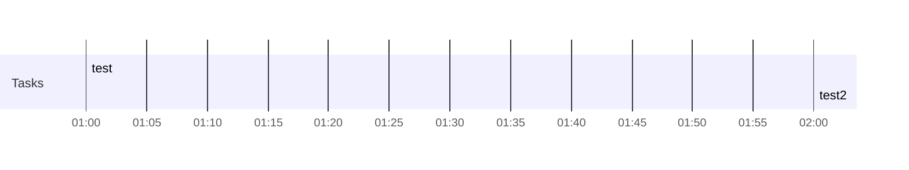

## Day Planner

```mermaid
gantt
    dateFormat  HH-mm
    axisFormat %H:%M
    %% Current Time: 12:47:25 PM
    section Tasks
    test     :01-00, 60mm
    test2     :02-00, 0mm
    section Breaks

```

- [x] 01:00 test
- [x] 02:00 test2