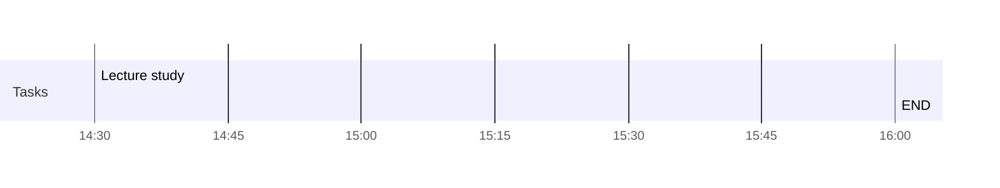

## Day Planner

```mermaid
gantt
    dateFormat  HH-mm
    axisFormat %H:%M
    %% Current Time: 4:00:17 PM
    section Tasks
    Lecture study     :14-30, 90mm
    END     :16-00, 0mm
    section Breaks

```

- [x] 14:30 Lecture study
- [ ] 16:00 END